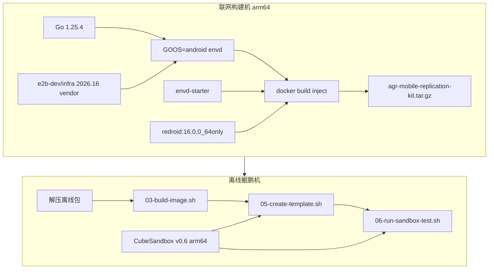

# 架构：AGR Mobile 官方 vs CubeSandbox 鲲鹏复刻

## 1. AGR Mobile 官方

来源（按时间顺序，见 [`docs/probes/README.md`](docs/probes/README.md)）：

- **探测 01**（2026-07-23）：[`docs/probes/01-20260723-mobile-hardware-mock.md`](docs/probes/01-20260723-mobile-hardware-mock.md) → 外部仓库正文
- **探测 02**（2026-08-24）：[`docs/probes/02-20260824-mobile-architecture.md`](docs/probes/02-20260824-mobile-architecture.md) + [`probe/artifacts/02-20260824-ap-shanghai/`](probe/artifacts/02-20260824-ap-shanghai/README.md)

### 1.1 运行时栈

```
客户端 (agr CLI / E2B SDK / Appium)
        │
        ▼ HTTPS + X-Access-Token
┌───────────────────────────────────────────┐
│ AGR 控制面 (ags.tencentcloudapi.com)       │
│ 数据面: {port}-{instanceId}.tencentags.com │
│  网关: OpenResty (x-cube-request-id)       │
└───────────────────────────────────────────┘
        │
        ▼
┌───────────────────────────────────────────┐
│ Cube Hypervisor MicroVM                    │
│   DMI: cube-hypervisor / Cube Hypervisor   │
│   ┌─ Linux Sidecar（共享 netns）─────────┐ │
│   │  :4723 Appium 3.1.1 (Node.js)        │ │
│   │  :8000 ws-scrcpy Web (Express)       │ │
│   │  :8080 Health (/healthz, /livez)     │ │
│   │  :5556 ADB WebSocket 桥               │ │
│   └──────────────┬────────────────────────┘ │
│                  │ ADB / HTTP 代理          │
│   ┌──────────────▼────────────────────────┐ │
│   │ SmartRun / ReDroid Android 14 x86_64  │ │
│   │  ro.hardware.gralloc = redroid        │ │
│   │  :5555 adbd  :8886 scrcpy-server     │ │
│   │  APK: io.appium.uiautomator2.*        │ │
│   └───────────────────────────────────────┘ │
│   ❌ :49983 envd — mobile 类型未暴露         │
└───────────────────────────────────────────┘
```

**不是** Cuttlefish、**不是** 经典 AVD goldfish；是 **Cube MicroVM + Linux Sidecar + ReDroid/SmartRun**。

> 完整文本架构图与逐项证据见 [`docs/probes/02-20260824-mobile-architecture.md`](docs/probes/02-20260824-mobile-architecture.md)（含 **PID 视角结构示意** 与命名空间说明）。  
> **结论总索引：** [`docs/FINDINGS.md`](docs/FINDINGS.md) · Sidecar OCI / PID 层级：[`docs/probes/05-20260824-sidecar-oci-and-pid-hierarchy.md`](docs/probes/05-20260824-sidecar-oci-and-pid-hierarchy.md)

### 1.2 实例内端口（2026-08-24 实测）

| 端口 | 角色 | 进程层 |
|------|------|--------|
| **5555** | adbd | Android（PID 138） |
| **8886** | scrcpy-server (`com.genymobile.scrcpy.Server`) | Android（PID 3379） |
| **4723** | Appium 3.1.1 UiAutomator2 | Linux sidecar（Node.js） |
| **8000** | ws-scrcpy Web UI | Linux sidecar（Express） |
| **8080** | Health Agent (`/healthz`, `/livez`) | Linux sidecar |
| **5556** | ADB WebSocket 桥（`agr mobile connect` 隧道） | Linux sidecar |
| **49983** | envd | ❌ **mobile 类型未暴露**（HTTPS `310508`） |
| 32001 | 未知内部服务 | ❓ 仅见监听 |

典型规格（探测时）：CPU **4600m**，Memory **8768Mi**，网络 **PUBLIC**。

### 1.3 控制面分工

| 通道 | 协议/工具 | 用途 |
|------|-----------|------|
| **ADB** | `agr instance mobile connect/adb` | 安装 APK、shell、logcat、文件 push/pull |
| **Instance Token** | E2B SDK `X-Access-Token`（创建时下发） | 数据面端口鉴权；**mobile 类型不暴露 envd :49983** |
| **Appium** | `https://{sandbox.get_host(4723)}` | UI 自动化 |
| **scrcpy** | `get_host(8000)` + WebSocket | 人工/调试投屏 |

`agr instance mobile` **仅有** connect / disconnect / adb / list — **无** WiFi/GPS/Camera 等产品级硬件 mock API。

### 1.4 android-world 变体

同 ReDroid 底座 + SmartRun `android_world_adapt`（实测 v23）：预装 Markor/OsmAnd 等 + telephony bootstrap；**仍无** Emulator gRPC `:8554`。

---

## 2. CubeSandbox 鲲鹏复刻栈

```
客户端 (cubemastercli / Cube SDK / adb)
        │
        ▼
┌───────────────────────────────────────────┐
│ CubeMaster + CubeAPI + network-agent       │
│ host_port 映射 → 沙箱内 5555 / 49983       │
└───────────────────────────────────────────┘
        │
        ▼
┌───────────────────────────────────────────┐
│ CubeVM (KVM, Android guest kernel)         │
│   ┌─────────────────────────────────────┐ │
│   │ OCI: sandbox-android-redroid-envd    │ │
│   │  PID1: envd-starter → envd :49983    │ │
│   │        → exec /init (Android)        │ │
│   │  adbd :5555                          │ │
│   └─────────────────────────────────────┘ │
└───────────────────────────────────────────┘
```

### 2.1 与 AGR 的差异（必须知晓）

| 维度 | AGR 官方（实测） | 本复刻（鲲鹏） |
|------|------------------|----------------|
| Hypervisor | Cube Hypervisor | CubeVM（CubeSandbox 开源） |
| Android 镜像 | SmartRun x86_64 **API 34** | ReDroid arm64 **API 36** |
| envd 二进制 | 平台内置（Linux 容器类或 Android 类，未公开细节） | **GOOS=android** 交叉编译，与 ReDroid 同容器 |
| 探活 | 平台托管 | `GET :49983/health`（cubebox 模板流水线） |
| 外网入口 | `*.tencentags.com` | 节点 IP + `host_port` 或自建 CubeProxy |
| Appium/scrcpy | 预置 | v1 **未打包**（可后续叠加） |

### 2.2 envd 位置（复刻设计选择）

AGR 公开文档**未说明** envd 与 ReDroid 是否同容器。鲲鹏复刻采用与 ReDroid **同一 OCI 镜像、同一 Android 用户态** 运行 envd，依据：

1. `cubesandbox-base` 的 Linux envd **无法**在 ReDroid/bionic 内执行；
2. Cube 模板探活要求实例内 `:49983` 可达；
3. 与 AGR SDK 双通道模型一致（envd + ADB 并存）。

---

## 3. 依赖关系图



---

## 4. CubeSandbox 官方 upstream 缺口

以下能力在 **TencentCloud/CubeSandbox master** 尚未发布，复刻包用 **fork 镜像 + cubebox** 过渡：

- `instance_type=android` 运行时（ADB/`boot_completed` 探针）
- `androidcbri` CBRI 插件与 Android 模板快照流水线
- 官方 `sandbox-android-*` 镜像 catalog

待 upstream 补齐后，可将探针从 `49983` 切到 `5555`，与 AGR **ADB-first** 模型更一致。
