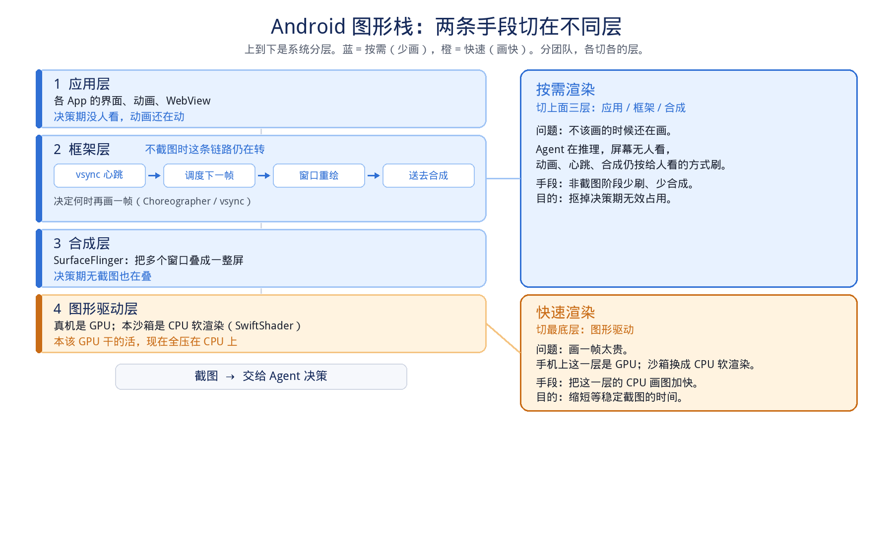

# Android 沙箱渲染：按需高帧率（完整稿）

> 本页提出问题并给出技术诉求。实现仍在验证。按需 / 快速两条并行，分由不同团队承担。

## 标题

Android 沙箱：AI Agent 基础设施之一，诉求按需高帧率渲染

## 1. 背景：训练对沙箱要什么，现在差在哪

### 训练到底要沙箱干什么

Mobile GUI 训练不是「开一台模拟器给人看」，而是用很多台 Android 环境给模型采轨迹：每台循环 **截图 → 决策 → 点击/滑动**，采完一批就更新策略。沙箱要同时满足三件事：

1. **能并开：** 一次训练要同时挂一批 **Android** 环境。公开、真正在模拟器/沙箱里在线采轨迹的工作，2024 年常见 **几十路**（DistRL 32、DigiRL 最多 64，超过约 32 路就要多机）；2025 年 MobileRL 把 Docker AVD **稳定开到 256 路**（文中写过可交互 1000，自己又说内存/磁盘顶住、稳定上限 256）。「数千台」出现在 UI-TARS-2 / UI-Venus 的 **Win/Ubuntu/Android 混部** 集群，**没有拆出 Android 占多少**，不能当纯 mobile 路数。对标装箱是 **2 核/台**（DigiRL、MobileGUI-RL）。桌面 ARPO 的 256 路不要拿来当 Android 的数。
2. **能截图、能操作：** 观测就是屏幕图，动作就是坐标手势。人不需要 60fps 视频流；模型一步看一张图。
3. **采得起、供得上：** 环境路数乘采样吞吐。路数开不满，同样预算少做实验。

单条轨迹并不长：DigiRL 每条最多 **10～20 步**，MobileGUI-RL 最多 **25 步**，评测任务几十到一百条量级。主流范式是 **「中短轨迹 × 多路并行 × 多轮迭代」**，不是「一轮 100 万步、100 路一起跑」。下面不用这个假算例。

### 现在存在的问题（实在讲）

我们这套 Android 沙箱是 MicroVM 里跑 ReDroid，`gpu_mode=guest`，画面走 **CPU 软渲染（SwiftShader）**。catalog 默认 **4 核 / 6GiB、1080×1920**。内部画像：复杂界面软渲染 **CPU 热点超过 50%**，部分场景 **帧率低于 10fps**。

具体就两件事：

- **截图时画得慢：** 模型要的是一张已经画完的图。帧率低于 10fps 时，凑齐这张图要多等。
- **不截图时还在画：** 决策（模型推理）往往占逐步大部分墙钟，此时没人看屏幕，合成仍按「给人看」的方式刷，CPU 继续烧。

对训练的实在后果：同样一批机器，**并开路数上不去**（每路比同行更吃核），采轨迹变慢，一轮实验更贵、更慢。

## 2. CPU 渲染对业务问题的影响（按真实训练规模量化）

### 2.1 主影响：每路更吃核 → 同样集群少开一半量级的环境

| 来源 | 环境 | 并行路数 | 单台配置 |
| --- | --- | --- | --- |
| DigiRL（NeurIPS 2024） | Android 模拟器 | 最多 **64**（&gt;32 要多机）；128 CPU | 约 **2 核** |
| DistRL（2024） | Android 模拟器 / 真机 | 最多 **32**（2 机 × 96 vCPU） | 未按 2 核写死 |
| MobileGUI-RL（2025） | AVD 池 | 随 batch，未写死；7B global batch 128 | **2 核** / 3GiB |
| MobileRL（2025） | Docker AVD | **稳定 256**；文中称可交互 1000 | &gt;5GiB 内存、&gt;30GB 盘；4 台 1TB 机器 |
| UI-Venus-1.5（2026） | 异构设备（含 mobile） | 数百～数千并发 | **未拆 Android** |
| UI-TARS-2（2025） | Win / Ubuntu / Android 混部 | 数千 VM | **未拆 Android** |
| 本沙箱 catalog | ReDroid | 节点核数 / 4 | **4 核** / 6GiB |

公开 **Android 沙箱在线训练** 的路数：学术主流是 **32～64**；2025 专做 mobile 采样的 MobileRL 把稳定并发顶到 **256**。桌面 ARPO 的 256 路、工业「数千 VM」都不是纯 Android 口径。

对标 Android 在线 RL 用 **2 核** 就能开一台；我们因为软渲染占掉约一半 CPU，catalog 按 **4 核** 装箱。同样 64 核节点：对标约 **32 路**，我们约 **16 路**，**并发约为对标的 50%**。即便对标已经是 256 路（MobileRL），按 4 核装箱同样腰斩。50% 为内部热点推到装箱核数的量级，最终以节点实开路数校准。

**业务上就是：** 同样预算少跑一半量级的并行实验，排队更长，一周训完的量更少。这是对「大规模并行训练」的主打击。

不要拿桌面 ARPO「8 路 &gt;6h / 256 路约 1.2h」当本问题的因果或当 Android 通行路数。我们改墙钟的因果链是 **2 核装箱 vs 4 核装箱**。

### 2.2 次影响：截图多等 100ms～1s，不是主矛盾

&lt;10fps 时，稳定截图常常多等 **100ms～1s**。主流轨迹只有十几到二十几步，决策本身又是秒级，**单条轨迹多等几秒，对「人能不能用」几乎无感，也撑不起「训练体验差」这个帽子。**

它仍然值得做，原因不是 100ms，而是：复杂页若迟迟画不完，截图窗口会从百毫秒拖成数秒，并行池被慢环境拖尾。快速渲染要防的是这条尾，不是日常那 100ms。

## 3. 技术诉求：Android 哪一层 → 两条手段

不先拆清切哪一层，按需和快速会对不准团队。

**上面三层（不该画还在画）→ 按需渲染**

- **应用层：** 动画、WebView 仍在动。
- **框架层：** 系统刷新心跳（vsync）仍在叫「再画一帧」。
- **合成层：** SurfaceFlinger 把窗口叠成整屏；决策期无截图也在叠。

**最底层（画一帧太贵）→ 快速渲染**

- **图形驱动层：** 手机上这一层是 GPU。本沙箱没有可直出的 GPU，换成 **CPU 软渲染（SwiftShader）**，App 和框架发出的画图命令全砸在 CPU 上。
- 快速渲染改的是这一层：把 CPU 画图加快。不改 App。

由此只收两条手段（并行、分团队）：

1. **按需渲染：** 切应用 / 框架 / 合成，非截图阶段少刷，把装箱从 4 核压回接近 2 核。  
2. **快速渲染：** 切图形驱动层，把 CPU 软渲染画快，缩短出帧。

## 4. 软件栈图

上到下是 Android 图形栈。蓝 = 按需（上面三层），橙 = 快速（最底层驱动）。

## 依据（脚注，不入口号正文）

- DigiRL, NeurIPS 2024：最多 **64** 路 Android 模拟器 / 128 CPU（约 2 核一台）；单机硬堆 64 CPU 只有 0.74 traj/min，分布式 1.74；&gt;32 路需多机。  
- DistRL, 2024：2 台 96 vCPU worker，最多 **32** 路 Android 模拟器/真机。  
- MobileGUI-RL, 2025：AVD **2 核** / 3GiB；实例数随 batch；7B global batch 128，每任务 8 条 rollout，≤25 步。未写死并发路数。  
- MobileRL, 2025（清华 + Z.AI 实习，**不是腾讯**）：Limitation 原文：“the system can only stably sustain up to 256 parallel rollouts, with each step taking more than 10 minutes … training 100 steps already takes more than 25 hours … large-scale image inference and network transmission introduce significant overhead.” 这里的 step 是 **RL 训练步**（batch 256、每条最多 50 个 GUI turn），不是一次点击。前文又写过可 concurrent interaction with over 1,000 environments，与 limitation 的稳定 256 并列，不能只取 1000。  
- UI-Venus-1.5, 2026：DaaS 接数千异构设备；RL 写过数百～数千并发，**未拆 Android**。  
- UI-TARS-2, 2025：数千 VM（Win / Ubuntu / Android 混部），**未拆 Android 路数**。  
- PhoneBuddy / PhoneWorld, 2026（**腾讯混元**）：真机 RL + mock app；PhoneWorld 评测写 6 台模拟器 / 3 路 vLLM。未公布 Android 沙箱训练并发路数。AppAgent（腾讯 GY Lab, 2023）是 GPT-4V 探索式操作，不是大规模在线 RL。  
- ARPO, 2025：桌面 GUI，不要当 Android 口径。  
- 本沙箱：目录 4 核 / 6GiB，`gpu_mode=guest`；内部画像 CPU 热点 &gt;50%、部分场景 &lt;10fps。
