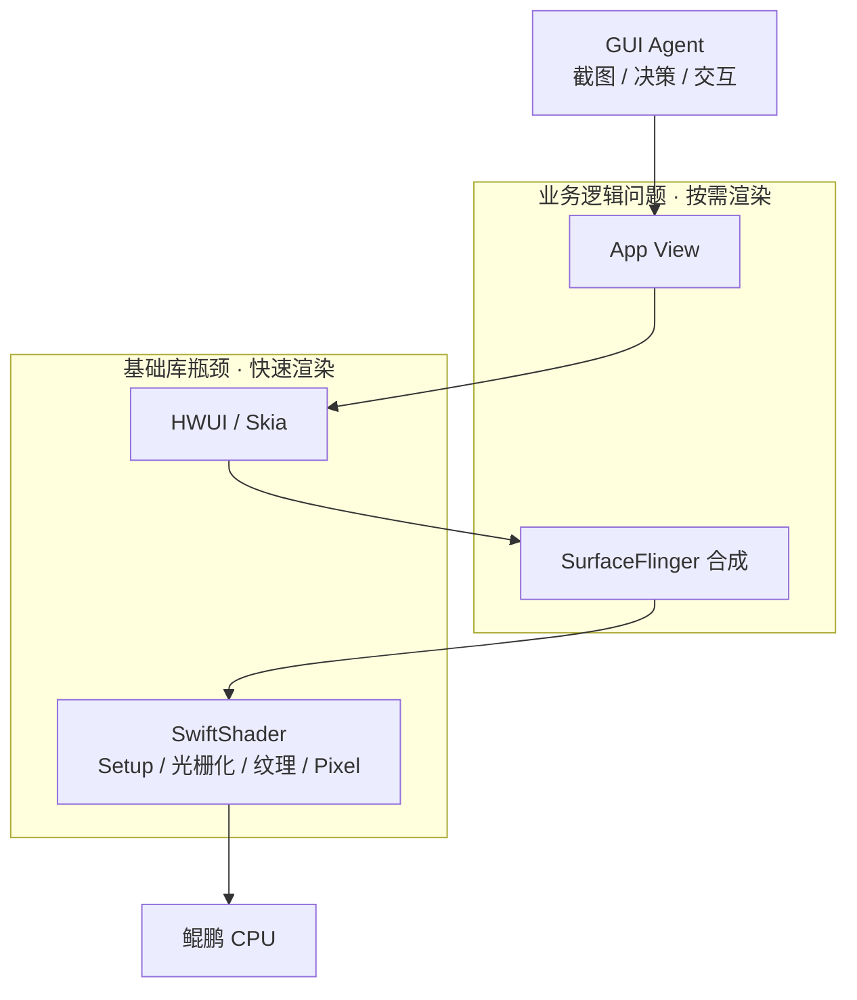

# Android 沙箱渲染：按需高帧率（材料稿）

> 本页提出问题并给出技术诉求方向。实现仍在验证。两条能力并行，分由不同团队承担。

## 标题

Android 沙箱：AI Agent 基础设施之一，诉求按需高帧率渲染

## 1. 背景：Mobile GUI 训练的业务目标与业务问题

**业务目标：** 大规模并行训练 Mobile GUI Agent，提高单位时间可采集的训练量，压低单步空等和单机成本。

**业务场景：** Agent 在沙箱中循环「截图 → 决策 → 交互」；只在截图时需要看见当前界面，决策期不消费连续画面。

**业务问题：** 训练必须同时开大量沙箱，但 Android 沙箱当前为 CPU 软渲染（`gpu_mode=guest`，SwiftShader 路径）。复杂界面又慢又占核：截图等不到稳定帧，决策期渲染还在空转，并发开不上、单步还在等。

## 2. 业务问题：CPU 渲染瓶颈的影响（量化）

沙箱规格（catalog）：**4 核 / 6GiB**，显示 **1080×1920**。内部画像：复杂界面软渲染 **CPU 热点超过 50%**，部分场景 **帧率低于 10fps**。

GUI Agent 依据稳定后的截图决策，影响拆成两条：

| 现象 | 数据 | 对业务的影响程度 |
| --- | --- | --- |
| 截图阶段出帧慢 | 帧率 &lt; 10fps（单帧 &gt;100ms）；软渲染 CPU 热点 &gt;50% | 稳定截图要等多帧才齐。相对 30～60fps 出帧，单步环境等待多出 **约 100ms～1s 量级**，训练逐步空等变长 |
| 非截图阶段渲染空转 | 公开评测中决策/规划可占逐步墙钟 **75%～94%**；此间渲染仍可占满 **约 2 个核**（4 核 × 50%） | Agent 不看屏时机器仍在画屏。同机可开路数被这 ~2 核卡住，并发密度上不去，单位时间训练样本变少 |

口径：50%、&lt;10fps、4 核规格为内部/catalog 画像；75%～94% 为 Computer-Use Agent 公开时延拆分；等待与可多开路数为由上述数据给出的**影响量级**，单步 `T_wait / T_step` 与多开倍数待补实测。

## 3. 技术诉求：围绕 CPU 软渲染打开瓶颈

渲染器要从「面向人持续刷帧」转到「面向人和 Agent」：截图时快出完整帧，非截图时少空转。问题出在 CPU 软渲染栈，不先拆栈就无法分工。

**基础库瓶颈（出帧慢 → 快速渲染团队）**

- **SwiftShader：** 顶点/图元 Setup、像素光栅化（QuadRasterizer / PixelRoutine）、纹理采样与混合全部在 CPU 上算；1080p 复杂界面时这里通常是热点。
- **Skia / HWUI：** DisplayList 回放、`saveLayer`/模糊、RenderThread 与主线程同步，放大提交给 SwiftShader 的绘制量。
- **JIT/Reactor：** 着色器首次编译抬高首帧；热路径未吃满鲲鹏 SIMD（SVE/SVE2）时，像素吞吐上不去。

**业务逻辑问题（空转占核 → 按需渲染团队）**

- 按面向人的 vsync 持续合成，决策期无观测仍在刷。
- 默认全屏 1080×1920、动画/过渡未关、过度绘制，无脏区就整帧重画。
- 截图走整帧读回，与「只要一张稳定图」的 Agent 需求不匹配。

**诉求（两条并行，分团队）**

1. **按需渲染：** 非截图阶段减少无效渲染，降低决策期 CPU 占用，提升单机并发。  
2. **快速渲染：** 缩短 SwiftShader 出帧时间，使 Agent 可快速获得稳定截图。

## 4. 软件栈图（仅 CPU 渲染相关层）

- 上半（View / 合成）：持续刷帧、全屏重绘、动画 → **按需**，减空转、提密度。  
- 下半（Skia / SwiftShader）：像素与纹理都在 CPU → **快速**，缩短出帧、减少截图等待。  
- 不展开 Kernel、KVM、网络等其余沙箱栈。
